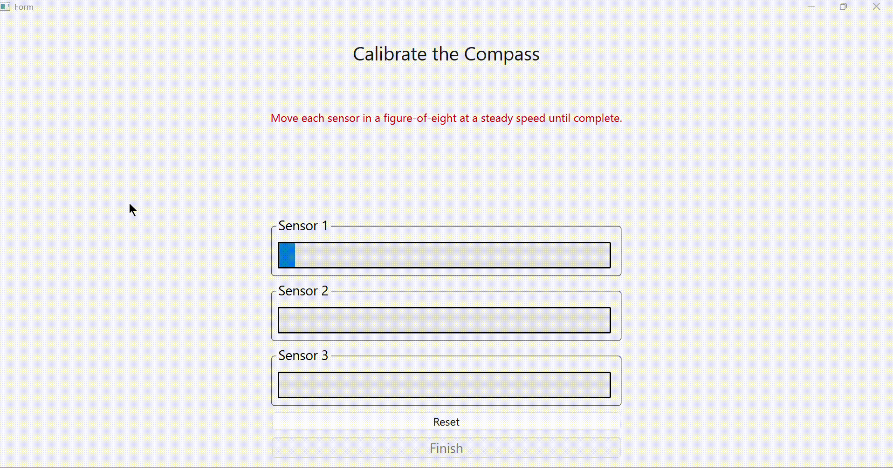
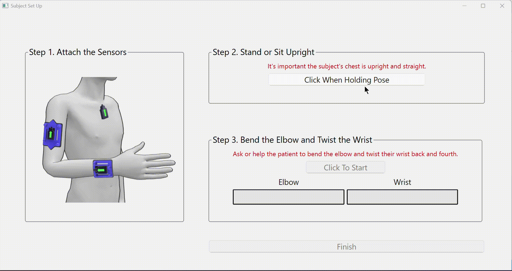
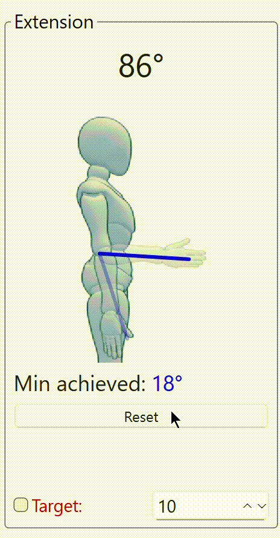
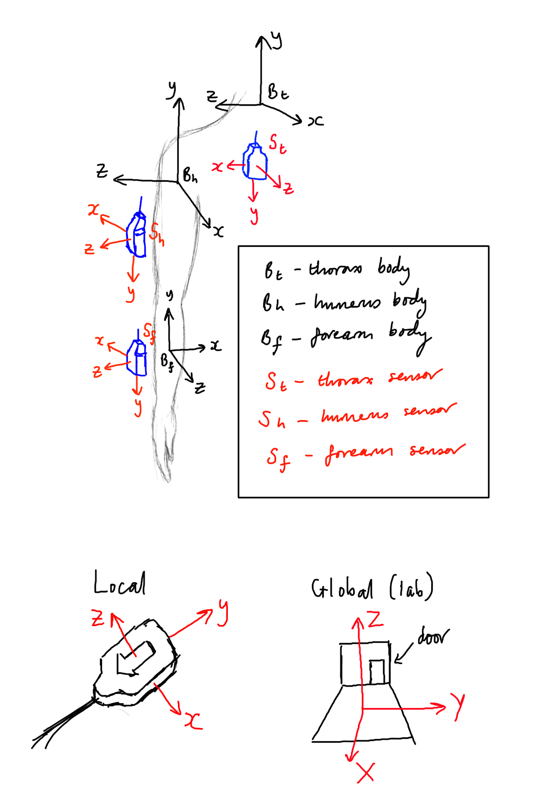

# Delsys GUI For Physios

This is an application designed for physiotherapists for real-time upper limb joint angle visualisation. It streams IMU orientation data from Delsys Trigno sensors, builds a rigid body model representing the thorax, humerus, and forearm, and performs forward kinematics to calculate shoulder and elbow joint angles. 

This repo was based on the [Delsys example GitHub repo](https://github.com/delsys-inc/Example-Applications/tree/main/Python). See this repo for more info on installation and use of the Delsys API.

Run with Python 3.9.13. This made pip install qmt easier as there was .whl available for python version <3.11.

Note: The magnetometer calibration and elbow-movement step are 'dummy' examples for the users benefit, and do not have any computational consequence. Subject-specific/sensor-to-segment calibration is in fact based on the single static pose, triggered during Step 2 of the Subject Set Up. 

## Demo of Use

Calibrating the magnetometers:  

 <br> 

Calibrating the subject (note direction of sensor arrows during attachment):

 <br> 

Tracking elbow joint movement and setting a target:



## Example App Instructions

1. Ensure that your Trigno system is connected to power and the PC via USB. Run main.py. Power on three Quattro sensors by removing from the charge station and introducing a magnet. (Sensor mode choice and orientation data channel may be different with different Delsys IMU sensors (e.g., Duo)).

2. Click the `Connect` button to connect the app to the station. This should automatically scan for paired sensors. See terminal for sensor connection info. If sensors are not already paired with the base, click `Pair`. Click `Scan` if needed to scan again. 

3. Sensor modes are set automatically for this application. To manually set different sensor modes, see Delsys example repo.

4. To begin the data stream and plotting, click the `Start` button. This will plot pitch-roll-yaw orientation data from the three connected sensors. To stop the data stream and plotting, click the `Stop` button.

5. At this stage, manually calibrate the sensor magnetometers by moving each sensor in a figure-of-eight motion for approx. 10s, then setting down still. A well-calibrated sensor should not drift when static.

6. Click `Begin Assessment` to begin physio-facing GUI. The following steps should be self-explanatory.


## Instructions From Original Delsys Repo

This is an example Python GUI application that uses the DelsysAPI AeroPy Layer to demonstrate functionality that users can implement in their own code. This example allows a user to connect to the base station, pair new sensors, scan for paired sensors, then stream EMG data visualized by plots.

Getting Started:
1. Install Python here: [Python 3.12.0](https://www.python.org/downloads/release/python-3120/).
2. Navigate to the `/Delsys-Python-Demo` base directory
3. Install dependencies using `python -m pip install -r requirements.txt`
4. Open `/AeroPy/TrignoBase.py` and copy/paste the key/license strings provided by Delsys Inc. during system purchase. Contact [support](https://delsys.com/support/) if you have any issues.
5. If you are using an IDE, set up your python interpreter/virtual environment from the settings.
6. Make sure the Trigno base station or lite are plugged in, then Run `DelsysPythonDemo.py`

## Further Reference

See [AeroPy Documentation](#AeroPy-Documentation) below.

See the DelsysAPI Documentation [here](http://data.delsys.com/DelsysServicePortal/api/web-api/index.html).

# AeroPy Documentation

## Navigation
[Python Setup](#Setup-(python)) &nbsp;<br>
[Connecting to the Trigno Base/Lite](#Connecting-to-the-Trigno-USB) &nbsp;<br>
[Sensor Management](#Sensor-Management) &nbsp;<br>
[Pre Data Collection Configuration](#Pre-Data-Collection-Configuration) &nbsp;<br>
[Data Collection Management](#Data-Collection-Management) &nbsp;<br>
[Helper Functions](#Helper-Functions) &nbsp;<br>
[DelsysAPI Object Properties](#DelsysAPI-Object-Properties) &nbsp;<br>

The DelsysAPI and AeroPy software is a development tool to be used in conjunction
with the Trigno Wireless Biofeedback System. The DelsysAPI is not intended to perform assessment or
diagnostic procedures. It is intended to be used as a software component of a third-party
software application. The function of the API is to manage the transfer of data from the Trigno
System to third-party software applications, and is designed to work exclusively with the Trigno
System. AeroPy is a simplification layer of the DelsysAPI to facilitate easy setup for configuring and streaming from sensors.
See the list of AeroPy commands below.

## Setup (python)

The `DelsysAPI.dll` must be inside of the project folder ie. resources/

```python
"""
This class creates an instance of the Trigno base. Put your key and license here.
"""
import clr
clr.AddReference("/resources/DelsysAPI")
clr.AddReference("System.Collections")

from Aero import AeroPy

key = ""
license = ""

class TrignoBase():
    def __init__(self):
        self.BaseInstance = AeroPy()
```

```python
base = TrignoBase()
TrigBase = base.BaseInstance
```
Call TrignoBase class from your program script.

```python
    def Connect_Callback(self):
        """Callback to connect to the base"""
        TrigBase.ValidateBase(key, license)
```
Use TrigBase variable to call AeroPy functions. See all AeroPy methods below:


## Coordinate Frame Definitions

 <br> 